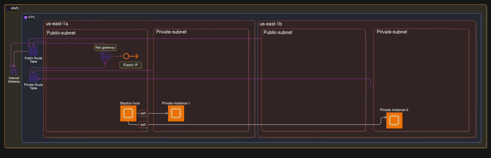
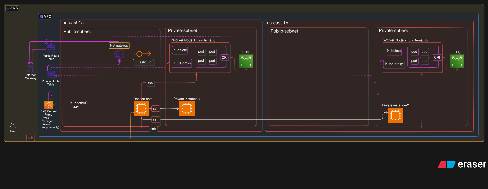

VPC Architecture


EKS Architecture


CI-CD Architecture


# Enterprise GitOps Platform – Step-by-Step Setup Guide

This guide explains the **exact flow to run the project successfully** in a structured and beginner-friendly way.  
The sequence of steps has been kept **the same as your original flow** so that a new user can follow it exactly and set up the project successfully on their end.

---

## Table of Contents

- [1. Create the Infrastructure Using Terraform](#1-create-the-infrastructure-using-terraform)
- [2. SSH into the Bastion Host](#2-ssh-into-the-bastion-host)
- [3. Configure the Bastion Host](#3-configure-the-bastion-host)
- [4. Configure AWS Access](#4-configure-aws-access)
- [5. Connect Bastion Host to the EKS Cluster](#5-connect-bastion-host-to-the-eks-cluster)
- [6. Install Cluster Autoscaler Through Helm](#6-install-cluster-autoscaler-through-helm)
- [7. Set Up Jenkins](#7-set-up-jenkins)
  - [Method 1: Use Jenkins with the Old Volume](#method-1-use-jenkins-with-the-old-volume)
  - [Method 2: Set Up Jenkins from Scratch](#method-2-set-up-jenkins-from-scratch)
- [8. Verify Jenkins Deployment](#8-verify-jenkins-deployment)
- [9. Access Jenkins UI](#9-access-jenkins-ui)
- [10. Set Up SonarQube](#10-set-up-sonarqube)
- [11. Connect SonarQube to Jenkins](#11-connect-sonarqube-to-jenkins)
- [12. Create Jenkins Jobs](#12-create-jenkins-jobs)
- [13. Configure Jenkins Credentials](#13-configure-jenkins-credentials)
- [14. Configure GitHub Webhooks for Jenkins](#14-configure-github-webhooks-for-jenkins)
- [15. Install Metrics Server](#15-install-metrics-server)
- [16. Set Up Envoy Gateway API](#16-set-up-envoy-gateway-api)
- [17. Install Gateway API CRDs and Envoy Gateway Controller](#17-install-gateway-api-crds-and-envoy-gateway-controller)
- [18. Set Up Argo CD](#18-set-up-argo-cd)
- [19. Convert Argo CD Server Service to NodePort](#19-convert-argo-cd-server-service-to-nodeport)
- [20. Log In to Argo CD](#20-log-in-to-argo-cd)
- [21. Connect GitHub Repository to Argo CD](#21-connect-github-repository-to-argo-cd)
- [22. Deploy the Argo CD Application](#22-deploy-the-argo-cd-application)
- [23. Access the Application](#23-access-the-application)
- [24. Access Mongo Express](#24-access-mongo-express)
- [25. Final Outcome](#25-final-outcome)
- [Quick Checklist](#quick-checklist)

---

## 1. Create the Infrastructure Using Terraform

First, run the Terraform scripts to create the infrastructure.

### Important Notes

- Run **all the `.tf` files** in the folder path below:

  [Terraform-Iac](https://github.com/shashankc20mca/Enterprise-GitOps-Platform-Automated-EKS-Infrastructure-and-3-Tier-Microservices/blob/main/Terraform-Iac/)

- **Do not run** the file `cluster_autoscaler_install_using_helm.tf` at this stage.
- That file must be run **later from the bastion host** because `endpoint_public_access` is set to `false` in `variable.tf`.
- This means the Kubernetes cluster can only be accessed through the bastion host.

### Why `cluster_autoscaler_install_using_helm.tf` is run later

Installing autoscaler through Helm requires direct cluster access. Since the EKS endpoint is private, this step can only be performed after logging into the bastion host.

### Before Running Terraform

Make sure to:

- update the required values in `variables.tf` as per your requirement
- include the AWS key pair details in the script files
- use the same key pair later for SSH access

---


Go to the Terraform folder containing Iac:


```bash
cd Terraform-Iac
```


Initialize Terraform:

```bash
terraform init
```

Preview the infrastructure changes:

```bash
terraform plan
```

Apply the Terraform configuration:

```bash
terraform apply
```
> **Note:** Terraform automatically reads and runs all `.tf` files present inside the `Terraform-Iac` folder, so you do not need to run each `.tf` file separately.


## 2. SSH into the Bastion Host

After the infrastructure is created, SSH into the bastion host using the key pair that you specified earlier in the Terraform scripts.

```bash
ssh -i <path-to-your-key.pem> ec2-user@<bastion-public-ip>
```

Replace:

- `<path-to-your-key.pem>` with the path to your `.pem` key file
- `<bastion-public-ip>` with the public IP address of your bastion host


---

## 3. Configure the Bastion Host

After entering the bastion host, install the required tools so that you can connect to the cluster and manage the worker nodes from there.

### Tools to Install on Bastion Host

- Helm
- Terraform
- Docker
- Kubectl
- AWS CLI

---

## 4. Configure AWS Access

Run the following command on the bastion host:

```bash
aws configure
```
Now enter your AWS credentials so that the bastion host can connect to your AWS account.

## 5. Connect Bastion Host to the EKS Cluster

Run the following command:

```bash
aws eks update-kubeconfig --name <cluster name> --region <region name>
```

Replace:

- `<cluster name>` with the cluster name you used
- `<region name>` with the AWS region you used

### Verify Cluster Access

Run:

```bash
kubectl get ns
```

If the command works, it confirms that the bastion host can communicate with the EKS cluster successfully.

---

## 6. Install Cluster Autoscaler Through Helm

Now install the autoscaler through Helm from the bastion host.

Use the following file:

- `cluster_autoscaler_install_using_helm.tf`

If you need to apply only the Cluster Autoscaler resources, go to the Terraform folder first:

```bash
cd Terraform-Iac
```

Initialize Terraform:

```bash
terraform init
```

Then run Terraform by targeting only the resources defined in `cluster_autoscaler_install_using_helm.tf`.

Sample command:

```bash
terraform plan -target=<resource_address> -out=tfplan
terraform apply tfplan
```


### Verify Autoscaler Installation

Run the following commands:

```bash
kubectl -n kube-system get deployment
kubectl -n kube-system get pods
kubectl -n kube-system logs deployment/<name>
```

---

## 7. Set Up Jenkins

There are two ways to set up Jenkins.

### Method 1: Use Jenkins with the Old Volume

Use the following Jenkins manifest files from the current repository:

- `jenkins_pv.yaml`
- `jenkins_pvc.yaml`
- `jenkins_old_volume.yaml`

Deploy Jenkins as a StatefulSet using the custom image that has already been created.

### About the Custom Jenkins Image

The custom image uses Jenkins as the base image and includes:

- Docker
- Trivy

These tools are required for the Jenkins pipeline.

### Important Note

The files `jenkins_pv.yaml`, `jenkins_pvc.yaml`, and `jenkins_old_volume.yaml` are configured in a way that allows mounting the existing EBS volume to retain Jenkins data.

Before running the Jenkins manifest, make sure to update the following in `jenkins_pv.yaml`:

- volume name
- region

Run the following commands in order:

```bash
kubectl apply -f jenkins_pv.yaml
kubectl apply -f jenkins_pvc.yaml
kubectl apply -f jenkins_old_volume.yaml
```

### Method 2: Set Up Jenkins from Scratch

Use the following Jenkins Kubernetes manifest file:

- `jenkins.yaml`

This manifest creates Jenkins as a StatefulSet using a new EBS volume created as specified in the file.

---
You can use the Jenkins Kubernetes manifest file available in the repository:

- [jenkins.yaml](https://github.com/shashankc20mca/CI-CD-GitOps-3-Tier-Microservices-Platform/blob/main/MERN-3-TIER-APP-k8s/jenkins.yaml)

```bash
kubectl apply -f jenkins.yaml
```


## 8. Verify Jenkins Deployment

After running the manifest successfully, verify that the Jenkins pod is running in the current namespace.

Run:

```bash
kubectl get pods
```

---

## 9. Access Jenkins UI

Check the Jenkins service using:

```bash
kubectl get svc
```

Since Jenkins is running inside Kubernetes, you need to port-forward the service so it can be accessed from the bastion host IP.

Run:

```bash
kubectl port-forward --address 0.0.0.0 svc/<service-name> 8080:8080
```

Now open the Jenkins port on the bastion security group.

> **Note:** As per your original step, open port `8000` on the bastion security group and access Jenkins using:
>
> `<baston_ip>:8000`

At this point, Jenkins should be accessible and ready for pipeline execution.

---

## 10. Set Up SonarQube

Before running the Jenkins pipelines, SonarQube must be configured because it will be used in the pipeline stages.

### Steps

- Run SonarQube on the bastion host using the official SonarQube Docker image
- Open port `9000` on the bastion host security group
- Access SonarQube using:

```text
<baston_ip>:9000
```

- Generate the SonarQube authentication token

This token will be used later in Jenkins.

---

## 11. Connect SonarQube to Jenkins

Log in to Jenkins UI and update the SonarQube configuration using the following path:

```text
Manage Jenkins > System > SonarQube servers
```

Add:

- SonarQube server URL
- SonarQube authentication token generated earlier

---

## 12. Create Jenkins Jobs

Now create two separate Jenkins jobs:

- one for frontend
- one for backend

Then add the corresponding Jenkins pipeline code.

### Frontend Pipeline

[Frontend_Jenkins](https://github.com/shashankc20mca/Enterprise-GitOps-Platform-Automated-EKS-Infrastructure-and-3-Tier-Microservices/blob/main/Frontend_Jenkins)

### Backend Pipeline

[Backend_Jenkinsfile](https://github.com/shashankc20mca/Enterprise-GitOps-Platform-Automated-EKS-Infrastructure-and-3-Tier-Microservices/blob/main/Backend_Jenkinsfile)

---

## 13. Configure Jenkins Credentials

Now set up the required credentials inside the Jenkins **Manage Credentials** section.

You need to configure:

- GitHub repository token
- Docker Hub repository token

This ensures the Jenkins pipeline can run without access issues.

After this is done, the pipeline should run successfully without any error.

---

## 14. Configure GitHub Webhooks for Jenkins

Now configure webhooks for both the frontend and backend repositories so that Jenkins pipelines are triggered whenever developers push code changes.

### Short Steps to Configure GitHub Webhook

Repeat the same steps for both frontend and backend repositories.

1. Open the GitHub repository
2. Go to **Settings**
3. Click **Webhooks**
4. Click **Add webhook**
5. In **Payload URL**, enter:

```text
http://<baston-ip>:8000/github-webhook/
```

6. Set **Content type** to:

```text
application/json
```

7. Add secret only if your Jenkins setup requires it
8. Under events, choose:

```text
Just the push event
```

9. Keep the webhook active
10. Click **Add webhook**

After this, Jenkins will be able to trigger the pipeline whenever code is pushed to the repository.

---

## 15. Install Metrics Server

Now install the metrics-server in the Kubernetes cluster so that HPA can use it to scrape pod and node metrics.

### Step 1: Install Metrics Server

```bash
kubectl apply -f https://github.com/kubernetes-sigs/metrics-server/releases/latest/download/components.yaml
```

### Step 2: Verify Installation

```bash
kubectl get pods -n kube-system
```

### Step 3: Get Node and Pod CPU/Memory Usage

```bash
kubectl top pods
kubectl top nodes
```

### Note

Metrics-server is deployed by default in the `kube-system` namespace.

---

## 16. Set Up Envoy Gateway API

Now set up Envoy Gateway API so that when `gateway.yaml`, `gateway_class.yaml`, and `httproute.yaml` are later applied by Argo CD, a Load Balancer is created automatically for application access.

### Create Namespace

```bash
kubectl create namespace envoy-gateway-system
```

---

## 17. Install Gateway API CRDs and Envoy Gateway Controller

### Step 1: Install Gateway API CRDs

```bash
kubectl apply -f https://github.com/kubernetes-sigs/gateway-api/releases/download/v1.0.0/standard-install.yaml
```

### Verify Installation

```bash
kubectl get crds | grep gateway
```

You should see:

- `gatewayclasses.gateway.networking.k8s.io`
- `gateways.gateway.networking.k8s.io`
- `httproutes.gateway.networking.k8s.io`

### Step 2: Install Envoy Gateway

```bash
kubectl apply -f https://github.com/envoyproxy/gateway/releases/download/v1.0.2/install.yaml
```

### Verify Envoy Gateway

```bash
kubectl get pods -n envoy-gateway-system
```

You should see the Envoy Gateway pod in **Running** state.

At this point, the complete CI part is ready.

---

## 18. Set Up Argo CD

Now start setting up the CD part by installing Argo CD in the cluster.

### Create Namespace

```bash
kubectl create namespace argocd
```

### Install Argo CD

```bash
kubectl apply -n argocd --server-side --force-conflicts -f https://raw.githubusercontent.com/argoproj/argo-cd/stable/manifests/install.yaml
```

### Verify Pods

```bash
kubectl get pods -n argocd
```

### Check Services

```bash
kubectl get svc -n argocd
```

> **Note:** One of the services will be `argocd-server` and it runs on port `443`.

---

## 19. Convert Argo CD Server Service to NodePort

### Step 1: Convert `argocd-server` to NodePort

```bash
kubectl patch svc argocd-server -n argocd \
-p '{"spec": {"type": "NodePort"}}'
```

### Step 2: Check Assigned NodePort

```bash
kubectl get svc argocd-server -n argocd
```

Example output:

```text
NAME            TYPE       CLUSTER-IP       EXTERNAL-IP   PORT(S)                      AGE
argocd-server   NodePort   172.20.217.174   <none>        80:30834/TCP,443:31556/TCP   4m52s
```

### Step 3: Create Port Forwarding

```bash
kubectl port-forward --address 0.0.0.0 svc/argocd-server -n argocd 8083:80 &
```

### Important Note

Make sure to open port `8083` on the bastion host security group.

You can then access Argo CD UI using:

```text
<baston-ip>:8083
```

---

## 20. Log In to Argo CD

The initial Argo CD admin password is auto-generated and stored inside the secret named `argocd-initial-admin-secret`.

Run:

```bash
kubectl get secret argocd-initial-admin-secret -n argocd -o yaml
```

You will get output similar to:

```yaml
apiVersion: v1
data:
  password: bE9Ja3hDWWZiM29EYTFDVQ==
```

Decode it using:

```bash
echo bE9Ja3hDWWZiM29EYTFDVQ== | base64 --decode
```

This gives the password.

### Login Credentials

- **Username:** `admin`
- **Password:** `<decoded password>`

---

## 21. Connect GitHub Repository to Argo CD

Now connect the Kubernetes manifests GitHub repository to Argo CD using the GitHub token generated earlier.

This enables Argo CD to monitor the repository and maintain the same desired state on the EKS cluster.

### Repository

[MERN-3-TIER-APP-k8s](https://github.com/shashankc20mca/Enterprise-GitOps-Platform-Automated-EKS-Infrastructure-and-3-Tier-Microservices/tree/main/MERN-3-TIER-APP-k8s)

### Steps in Argo CD UI

Go to:

```text
Settings > Repositories > + Connect Repo
```

Fill in the required details and click **Connect**.

### Note

Argo CD polls the Git repository every 3 minutes by default.  
If you want to avoid this delay, you can configure a Git webhook.

---

## 22. Deploy the Argo CD Application

Now the final step in Argo CD setup is to activate deployment by applying `application.yaml`.

### Reference file

[application.yaml](https://github.com/shashankc20mca/Enterprise-GitOps-Platform-Automated-EKS-Infrastructure-and-3-Tier-Microservices/blob/main/MERN-3-TIER-APP-k8s/application.yaml)

Run:

```bash
kubectl apply -f application.yaml
```

> **Important:** Make sure the details in `application.yaml` are correct before deploying.

Once this file is applied, Argo CD will start applying the remaining manifest files from the Kubernetes repository.

---

## 23. Access the Application

After some time, you will be able to access the application using the Load Balancer endpoint created by Envoy.

Run:

```bash
kubectl get svc -n envoy-gateway-system
```

Use the output to get the Load Balancer URL.

---

## 24. Access Mongo Express

To get the Load Balancer URL for Mongo Express, run:

```bash
kubectl get svc
```

Mongo Express can be used to view the data stored in the MongoDB database.

---

## 25. Final Outcome

At this stage, the complete CI/CD setup is ready.

From now on:

- whenever frontend code changes are pushed, the frontend Jenkins pipeline is triggered
- whenever backend code changes are pushed, the backend Jenkins pipeline is triggered
- Jenkins handles the CI flow
- Argo CD handles deployment to the EKS cluster
- the application gets updated automatically on Kubernetes

At this point, features such as:

- HPA
- Cluster Autoscaler

will also be working.

